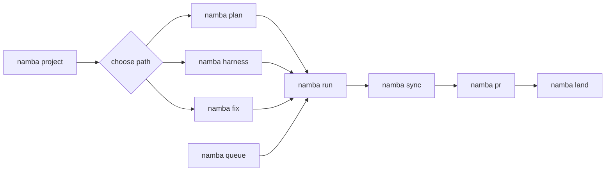

<!-- Generated by `namba sync`. Edit `.namba/config/sections/docs.yaml` or the README renderer instead of editing this file directly. -->

<p align="center">
  
</p>

# NambaAI

NambaAI는 Codex와 함께 일할 때 "다음에 뭘 해야 하지?"를 덜 헤매게 해주는 작업 안내서입니다. 핵심 차별점은 실행 전 프롬프트 교정입니다. 막연한 아이디어를 목표, 범위, 제약, 수용 기준으로 먼저 정리한 뒤 Codex가 코딩을 시작하게 합니다. 저장소를 처음 준비하고, 지금 상황에 맞는 명령을 고르고, 큰 작업은 검토 가능한 계획으로 나눈 뒤, 끝난 뒤에는 문서와 체크리스트까지 맞춰 줍니다.

[English](README.md) | [한국어](README.ko.md) | [日本語](README.ja.md) | [中文](README.zh.md)

[Latest Release](https://github.com/Nam-Cheol/namba-ai/releases/latest) | [CI](https://github.com/Nam-Cheol/namba-ai/actions/workflows/ci.yml) | [Security](SECURITY.md)

[](https://github.com/Nam-Cheol/namba-ai/releases/latest) [](https://github.com/Nam-Cheol/namba-ai/actions/workflows/ci.yml) [](SECURITY.md) [](LICENSE) [](docs/getting-started.ko.md)

이 배지는 릴리스, CI, 보안 정책, 라이선스, 시작 문서처럼 새 사용자가 먼저 확인할 수 있는 신뢰 신호만 보여줍니다.

<p align="center">
  <a href="docs/getting-started.ko.md"></a>
  <a href="docs/workflow-guide.ko.md"></a>
  <a href="https://github.com/Nam-Cheol/namba-ai/releases/latest"></a>
  <a href="SECURITY.md"></a>
</p>

## 먼저 실행할 것

| 단계 | 실행 | 목적 |
| --- | --- | --- |
| 1 | `namba project` | 저장소 상태와 project docs를 최신화합니다. |
| 2 | `namba plan "description"` | 기능 작업을 review 가능한 SPEC로 만듭니다. |
| 3 | `namba run SPEC-001` | SPEC을 구현하고 검증합니다. |

### 명령 흐름

가장 자주 쓰는 NambaAI 명령 흐름입니다. 여러 기존 SPEC을 순서대로 처리할 때는 `namba queue`에서 시작합니다.



## 🧭 어떤 명령을 써야 하나요?

| 상황 | 명령 | 다음 문서 |
| --- | --- | --- |
| 저장소 상태 파악 | `namba project` | [시작 가이드](docs/getting-started.ko.md) |
| 기능 계획 | `namba plan "description"` | [워크플로 가이드](docs/workflow-guide.ko.md) |
| harness 계획 | `namba harness "description"` | [워크플로 가이드](docs/workflow-guide.ko.md) |
| 버그 수리 | `namba fix "issue"` 또는 `namba fix --command plan "issue"` | [워크플로 가이드](docs/workflow-guide.ko.md) |
| 기존 SPEC 순차 처리 | `namba queue start SPEC-001..SPEC-003` | [워크플로 가이드](docs/workflow-guide.ko.md) |
| 산출물 갱신 | `namba sync` | [CI](https://github.com/Nam-Cheol/namba-ai/actions/workflows/ci.yml) |
| PR 인계 | `namba pr "title"` | [릴리스](https://github.com/Nam-Cheol/namba-ai/releases/latest) |

## 다음에 읽을 문서

| 문서 | 읽을 때 |
| --- | --- |
| [시작 가이드](docs/getting-started.ko.md) | 설치, update, 제거, init, 첫 실행 경로가 필요할 때 |
| [워크플로 가이드](docs/workflow-guide.ko.md) | run 모드, queue, review readiness, PR/merge 흐름이 필요할 때 |
| [Release](https://github.com/Nam-Cheol/namba-ai/releases/latest) | 설치할 버전과 checksum을 확인할 때 |
| [CI](https://github.com/Nam-Cheol/namba-ai/actions/workflows/ci.yml) | 현재 검증 상태를 확인할 때 |
| [Security](SECURITY.md) | 보안 정책과 신고 경로를 확인할 때 |

## 🧰 NambaAI로 할 수 있는 일

- 빈 폴더에서도 `namba init .` 한 번으로 Codex가 참고할 기본 안내문과 설정을 만들 수 있습니다.
- 어떤 명령을 써야 할지 애매하면 `$namba-coach`에게 현재 하고 싶은 일을 말하면 됩니다.
- 사용법 자체가 궁금하면 `$namba-help`로 설명만 받을 수 있습니다. 이 경로는 파일을 바꾸지 않습니다.
- 계획이 준비되면 `namba run SPEC-XXX`로 실행하고, 끝난 뒤 `namba sync`, `namba pr`, `namba land`로 문서 정리와 리뷰/머지 흐름을 이어 갑니다.
- 여러 SPEC을 대량 생성해 둔 경우 `namba queue start`로 하나씩 실행하고, 실패한 validation/checks/non-mergeable PR 같은 위험 상태에서는 blocked로 멈춘 뒤 `namba queue resume`으로 이어갈 수 있습니다.
- 구현 전에 제품, 엔지니어링, 디자인 관점의 확인이 필요하면 `$namba-plan-pm-review`, `$namba-plan-eng-review`, `$namba-plan-design-review`를 사용할 수 있습니다.
- 팀원들이 같은 버전을 쓰도록 `namba update`로 CLI를 맞출 수 있습니다.

## 🚀 빠른 시작

### 1. NambaAI 설치

Windows:

```powershell
irm https://raw.githubusercontent.com/Nam-Cheol/namba-ai/main/install.ps1 | iex
```

macOS / Linux:

```bash
curl -fsSL https://raw.githubusercontent.com/Nam-Cheol/namba-ai/main/install.sh | sh
```

### 2. 새 저장소 초기화

```text
namba init .
```

### 3. Codex에서 작업 시작

```text
namba project
namba plan "add login audit logs"
namba run SPEC-001
namba sync
namba pr "add login audit logs"
namba land
```

- agent, skill, workflow, orchestration 재사용 작업이면 `namba plan` 대신 `namba harness "description"`를 넣으세요.

## ✅ 로컬 품질 게이트

- PR 전에 `scripts/quality.sh`로 CI의 핵심 품질 바를 로컬에서 실행할 수 있습니다.
- `go.mod`의 `toolchain go1.26.3` 기준을 사용하므로 CI와 `GOTOOLCHAIN=auto` 로컬 실행이 알려진 Go 1.26.2 표준 라이브러리 취약점을 피합니다.
- 이 게이트는 Python unittest, Go unit/race tests, harness eval regression, evidence schema validation, report JSON validation, gofmt, go vet, staticcheck, govulncheck, Go coverage report를 실행합니다.
- 기본 artifact는 coverage profile/text, `eval-scorecard.json`, `eval-summary.md`, `report.json`, `schema-validation.txt`입니다.
- aggregate Go coverage threshold는 73.0%입니다. 계획 중 측정한 73.7% baseline보다 약간 낮게 잡아 Go version/reporting noise는 흡수하고 의미 있는 회귀는 막습니다.
- `staticcheck` 또는 `govulncheck`가 없으면 스크립트가 정확한 `go install` 명령을 출력하고 중단합니다.

## 🪝 Hook Runtime

- 처음 쓰는 중이라면 이 섹션은 건너뛰어도 됩니다. Hook은 실행 중 특정 시점에 자동으로 돌릴 검사나 알림을 붙이고 싶을 때 사용합니다.
- Codex lifecycle hook은 `namba init .`가 `.codex/hooks.json`, `.codex/hooks/namba_codex_guard.py`, POSIX `.codex/hooks/namba_codex_guard.sh`, Windows `.codex/hooks/namba_codex_guard.ps1` launcher로 미리 생성합니다. 이 hook은 Namba context를 주입하고, 애매한 prompt는 전송을 막지 않고 질문/정리 쪽으로 유도하며, 권한 요청의 위험성을 설명하고, final response 형식과 managed instruction surface 변경 후 `namba regen`/validation을 상기시키고, plugin hook과 같은 payload가 중복 실행될 때 동일 Namba guard 출력을 억제합니다.
- Codex는 repo-local hook을 실행하기 전에 리뷰를 요구합니다. 첫 interactive Codex 세션에서 `6 hooks need review`가 보이면 `/hooks`를 열고 명령이 현재 저장소의 `.codex/hooks/namba_codex_guard.sh` 또는 Windows `.codex/hooks/namba_codex_guard.ps1` launcher만 가리키는지 확인한 뒤 승인하세요.
- `.codex/hooks.json`은 Codex interactive guardrail이고, `.namba/hooks.toml`은 `namba run`의 evidence/validation boundary입니다.
- Codex 0.131은 approval mode, permissions, service tier, effective workspace roots를 TUI에 표시할 수 있습니다. Namba는 이 상태를 설명하지만 repo config로 소유하거나 저장하지 않습니다. Git helper가 repo hook을 무시할 수 있으므로 Namba validation은 Git hook이 아니라 quality command와 run evidence에 의존합니다.
- 📍 등록 위치: 저장소 루트에 `.namba/hooks.toml`을 만들면 `namba run SPEC-XXX`가 실행 중 자동으로 읽습니다.
- 🧩 등록 형식: `[hooks.<hook_name>]` 테이블을 추가하고 `event`, `command`, `cwd`, `timeout`, `enabled`, `continue_on_failure`를 채웁니다.
- 🧾 실행 증거: 각 hook의 stdout/stderr는 `.namba/logs/runs/<log-id>-hooks/` 아래에 저장되고, 결과는 `<log-id>-evidence.json`의 `hooks` 배열에 기록됩니다.
- 🚦 실패 정책: 기본은 계속 진행입니다. `continue_on_failure = false`인 hook이 실패하면 Namba run이 중단되고 `on_failure` hook이 한 번 실행됩니다.

```toml
[hooks.validation_guard]
event = "before_validation"
command = "go test ./..."
cwd = "."
timeout = 120
enabled = true
continue_on_failure = false
```

- ⚙️ 자주 쓰는 이벤트: `before_preflight`, `after_preflight`, `before_execution`, `after_execution`, `before_validation`, `after_validation`, `on_failure`.
- 🔭 Tool-boundary 이벤트인 `after_patch`, `after_bash`, `after_mcp_tool`은 runner가 typed observation을 제공할 때만 실행되며, 자유 형식 로그에서 추론하지 않습니다.

## 🔌 Optional Codex Platform Readiness

- 로컬 NambaAI 흐름에는 plugin 설치, marketplace publish, remote-control, remote environment, Python SDK가 필요하지 않습니다.
- Codex unified `@` mention은 파일, 디렉터리, plugin, skill을 찾는 Codex 플랫폼 기능입니다. Namba workflow 라우팅은 `$namba-*` skill과 `namba ...` 명령 의미를 기준으로 판단합니다.
- Plugin packaging, marketplace CLI, version-aware sharing, share checkout, shared-workspace plugin bucket, default-enabled plugin hook은 선택적 readiness path입니다. Namba docs가 이를 언급해도 publish/install 요구가 아닙니다.
- Remote-control과 remote environment는 `.namba/logs/project/codex-diagnostics-evidence.json`, run evidence, queue evidence의 `codex_diagnostics`에 `unavailable`, `disabled`, `enabled`, `configured`, `local_fallback` 같은 상태로만 기록됩니다.
- Remote readiness 상태가 workflow 실패를 뜻하지 않습니다. 일반 `namba plan`, `namba run`, `namba queue`, `namba sync`, `namba pr`, `namba land`, `namba release`는 기본적으로 local-first입니다.
- Codex Python SDK를 언급해야 할 때 distribution은 `openai-codex`, import package는 `openai_codex`로 씁니다. NambaAI는 이 언급만으로 Python runtime dependency를 추가하지 않습니다.

## 📦 설치, 업데이트, 제거

- 설치 (Windows): `irm https://raw.githubusercontent.com/Nam-Cheol/namba-ai/main/install.ps1 | iex`
- 설치 (macOS / Linux): `curl -fsSL https://raw.githubusercontent.com/Nam-Cheol/namba-ai/main/install.sh | sh`
- Installer는 설치 전에 release checksum을 검증하고, checksum이 없거나 맞지 않으면 fail closed로 중단합니다. 수동 검증이 필요하면 release asset과 `checksums.txt`를 받은 뒤 asset의 SHA-256 digest를 정확한 asset 이름 항목과 비교하세요.
- 최신 릴리스로 업데이트: `namba update`
- 특정 릴리스로 고정: `namba update --version vX.Y.Z`
- `namba update`는 NambaAI CLI만 업데이트합니다. upstream Codex CLI는 `codex update`로 업데이트합니다.
- `namba update`는 Codex 0.131 baseline advice를 출력할 수 있지만 Codex 설치나 업데이트는 관리하지 않습니다.
- Codex diagnostics evidence는 `.namba/logs/project/codex-diagnostics-evidence.json`, `.namba/logs/runs/<log-id>-evidence.json`, `.namba/logs/runs/<spec-id-lower>-queue-evidence.json`에서 확인합니다.
- 제거 (Windows): `%LOCALAPPDATA%\Programs\NambaAI\bin\namba.exe`를 삭제하고 더 이상 필요 없으면 `%LOCALAPPDATA%\Programs\NambaAI\bin`를 사용자 `PATH`에서 제거합니다.
- 제거 (macOS / Linux): `~/.local/bin/namba`를 삭제하고 더 이상 필요 없으면 설치기가 추가한 `PATH` 줄을 `~/.profile` 또는 `~/.zshrc`에서 제거합니다.

## 🚢 릴리스 흐름

- `$namba-release`는 clean `main`, 검증, commit 기반 릴리스 노트, `.namba/releases/<version>.md` handoff를 확인한 뒤 릴리스를 진행하는 Codex-facing workflow입니다.
- `namba release`는 `main`에서 clean working tree를 요구합니다.
- `--push`는 새 태그와 `main`을 함께 push한 뒤 GitHub Release workflow를 트리거합니다.
- GitHub Release body는 생성된 릴리스 노트를 사용하고, 기존 asset matrix와 필수 `checksums.txt` publication은 유지됩니다. 모든 release archive는 installer가 압축 해제 전에 검증할 수 있도록 정확한 asset 이름으로 `checksums.txt`에 포함되어야 합니다.

## 🧩 Codex에서 쓰는 Command Skill

- `$namba`: Codex에게 "상황 보고 알아서 맞는 입구를 골라줘"라고 맡길 때 쓰는 일반 라우터입니다.
- `$namba-help`: NambaAI 사용법, 어떤 명령이나 skill을 고르면 되는지, 어느 문서를 보면 되는지 설명만 듣고 싶을 때 씁니다. 파일은 바꾸지 않습니다.
- `$namba-coach`: 하고 싶은 일은 있는데 명령이 헷갈릴 때 씁니다. 필요한 질문만 하고 다음 Namba workflow handoff를 추천합니다.
- `$namba-create`: repo-local skill이나 custom agent를 바로 만들고 싶을 때 씁니다. 먼저 미리보기를 보고 확인한 뒤 생성합니다.
- `$namba-project`: 작업 전이나 큰 변경 뒤에 프로젝트 문서와 codemap을 새로 고칠 때 씁니다.
- `$namba-plan`: 새 기능이나 제품 변경을 검토 가능한 작업 계획으로 만들 때 씁니다.
- `$namba-plan`은 `게시판 만들어줘`처럼 모호한 요청이면 CLI 실행 전 질문을 반복해 Goal/Scope/Constraints/Acceptance를 먼저 잡습니다. 가능하면 Codex Plan mode 선택 UI를 clarification surface로 쓰고, 그 출력만 `namba plan` 실행 입력으로 넘깁니다.
- `$namba-harness`: 재사용할 agent, skill, workflow, orchestration 작업을 계획할 때 씁니다.
- `$namba-fix`: 현재 workspace에서 버그를 바로 고칠 때 씁니다. review 가능한 bugfix SPEC가 필요하면 `namba fix --command plan "issue description"`을 고릅니다.
- `$namba-plan-review`: 계획을 만든 뒤 product / engineering / design 관점에서 한 번에 점검하고 싶을 때 씁니다.
- `$namba-plan-pm-review` / `$namba-plan-eng-review` / `$namba-plan-design-review`: 제품, 엔지니어링, 디자인 중 필요한 관점만 따로 점검할 때 씁니다.
- `$namba-run`: 이미 만든 SPEC 패키지를 현재 Codex 세션에서 실행할 때 씁니다.
- `$namba-queue`: 이미 존재하는 여러 SPEC 패키지를 queue로 순서대로 처리하고, status/resume/pause/stop을 다룰 때 씁니다.
- `$namba-sync`: README 묶음, 프로젝트 문서, codemap, PR 준비 산출물을 최신 상태로 맞출 때 씁니다.
- `$namba-pr` / `$namba-land`: GitHub 리뷰로 넘기고, 통과한 뒤 안전하게 머지할 때 씁니다.
- `$namba-review-resolve`: PR review thread를 확인하고, 의미 있는 지적만 수정/답변/resolve한 뒤 검증 증거와 함께 다시 review를 요청할 때 씁니다.
- `$namba-release`: commit history로 릴리스 노트를 만든 뒤 Namba의 guarded release 경로로 태그와 GitHub Release를 진행할 때 씁니다.
- `$namba-regen` / `$namba-update`: repo-local Codex 자산을 다시 만들거나 설치된 `namba` CLI를 업데이트할 때 씁니다.

## 🗺️ Skill To Command Mapping

Codex에서 `$...` 형태로 부르는 skill이 실제로는 어떤 Namba 명령 흐름으로 이어지는지 빠르게 보는 표입니다.

- `$namba-help` -> read-only Namba 사용 안내, 직접적인 CLI 변경 없음
- `$namba-coach` -> 현재 목표를 다음 Namba workflow handoff로 연결하는 read-only command coaching, 직접적인 CLI 변경 없음
- `$namba-create` -> `.agents/skills/*` 또는 `.codex/agents/*`를 위한 skill-first 생성 흐름, 이 slice에서는 public `namba create` CLI를 추가하지 않음
- `$namba-project` -> `namba project`
- `$namba-plan` -> `namba plan "description"`
- `$namba-harness` -> `namba harness "description"`
- `$namba-plan-review` -> `namba plan "description"` 또는 `namba harness "description"` + 병렬 review + aggregate validation loop
- `$namba-fix` -> `namba fix "issue description"` 또는 `namba fix --command plan "issue description"`
- `$namba-run` -> `namba run SPEC-XXX`
- `$namba-queue` -> `namba queue start <SPEC-RANGE|SPEC-LIST>` / `status` / `resume` / `pause` / `stop`
- `$namba-sync` -> `namba sync`
- `$namba-pr` -> `namba pr "title"`
- `$namba-land` -> `namba land`
- `$namba-review-resolve` -> active PR review thread 처리 + validation + re-review request, public CLI 변경 없음
- `$namba-release` -> release notes 생성 + `namba release --version <version> --push`
- `$namba-regen` -> `namba regen`
- `$namba-update` -> `namba update [--version vX.Y.Z]`

## 👥 Codex용 Custom Agents

- Custom Agent는 Codex 안에서 역할을 나눠 맡기는 전담 도우미입니다. 혼자 다 처리하기보다, 필요한 때에만 알맞은 역할을 부릅니다.
- Strategy and readiness: `namba-product-manager`는 목표와 범위를 정리하고, `namba-planner`는 계획을 실행 순서로 바꾸며, `namba-plan-reviewer`는 시작해도 될 만큼 계획이 맞는지 확인합니다.
- UI split: `namba-designer`는 화면의 방향성과 참고자료를 보고, `namba-frontend-architect`는 화면 구조를 계획하고, `namba-frontend-implementer`는 승인된 UI를 구현하며, `namba-mobile-engineer`는 모바일 제약을 챙깁니다.
- Routing examples: `Redesign this landing page hero so it stops looking generic`는 `namba-designer`, `Plan the component/state split for this dashboard`는 `namba-frontend-architect`, `Implement the approved dashboard filters and responsive states`는 `namba-frontend-implementer`로 보냅니다.
- Backend and data: `namba-backend-architect`, `namba-backend-implementer`, `namba-data-engineer`가 서버, 저장소, 마이그레이션, 데이터 흐름을 맡습니다.
- Security and delivery: `namba-security-engineer`, `namba-test-engineer`, `namba-devops-engineer`, `namba-reviewer`가 보안, 테스트 신뢰도, 배포, 최종 확인을 맡습니다.
- General delivery: `namba-implementer`는 여러 영역이 섞였지만 큰 팀까지는 필요 없는 작업을 맡는 일반 실행 역할입니다.

## 📚 더 읽기

- [시작 가이드](docs/getting-started.ko.md): 설치, 업데이트, 제거, init, 첫 실행 흐름
- [워크플로 가이드](docs/workflow-guide.ko.md): update / regen / sync / pr / land 차이, run 모드, 생성 산출물, 협업 기본값
- [Codex Upstream Reference](docs/codex-upstream-reference.md): 이 저장소가 따르는 upstream 기준
- [SECURITY.md](SECURITY.md): 보안 정책

## 🧱 기술 스냅샷

- `.namba/`에는 NambaAI가 기억해야 할 설정, 작업 계획, 프로젝트 문서가 들어갑니다.
- `.agents/skills/`에는 Codex가 바로 불러 쓸 수 있는 Namba 전용 안내서가 들어갑니다.
- `.codex/agents/*.toml`에는 Codex 안에서 역할을 나눠 맡길 custom agent 설정이 들어갑니다.
- Emoji density rule: section headings by default, selected lifecycle/caution bullets only when they add scan value, and no emoji inside command literals, language links, release/CI/security links, or shell snippets.
- `namba update`, `namba regen`, `namba sync`, `namba pr`, `namba land`는 이름은 비슷하지만 서로 다른 문제를 푸는 명령입니다. 헷갈리면 `$namba-coach`나 `$namba-help`로 먼저 물어보면 됩니다.

<details>
<summary>고급 참고 자료</summary>

- 긴 command semantics, queue state, review readiness, PR/merge flow는 workflow guide에 둡니다.
- [워크플로 가이드](docs/workflow-guide.ko.md)
- [Release](https://github.com/Nam-Cheol/namba-ai/releases/latest)
- [CI](https://github.com/Nam-Cheol/namba-ai/actions/workflows/ci.yml)
- [Security](SECURITY.md)

</details>
