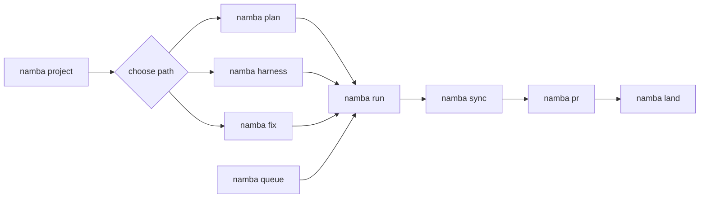

<!-- Generated by `namba sync`. Edit `.namba/config/sections/docs.yaml` or the README renderer instead of editing this file directly. -->

<p align="center">
  
</p>

# NambaAI

NambaAI is a practical guide for working with Codex without guessing the next step. Its differentiator is prompt refinement before execution: vague ideas are shaped into goals, scope, constraints, and acceptance criteria before Codex starts coding. It sets up the repository, helps you choose the right command, turns bigger work into reviewable plans, and refreshes docs and checklists after the work is done.

[English](README.md) | [한국어](README.ko.md) | [日本語](README.ja.md) | [中文](README.zh.md)

[Latest Release](https://github.com/Nam-Cheol/namba-ai/releases/latest) | [CI](https://github.com/Nam-Cheol/namba-ai/actions/workflows/ci.yml) | [Security](SECURITY.md)

[](https://github.com/Nam-Cheol/namba-ai/releases/latest) [](https://github.com/Nam-Cheol/namba-ai/actions/workflows/ci.yml) [](SECURITY.md) [](LICENSE) [](docs/getting-started.md)

These badges show only trust signals a new user can verify first: release, CI, security policy, license, and starting docs.

<p align="center">
  <a href="docs/getting-started.md"></a>
  <a href="docs/workflow-guide.md"></a>
  <a href="https://github.com/Nam-Cheol/namba-ai/releases/latest"></a>
  <a href="SECURITY.md"></a>
</p>

## Run First

| Step | Run | Purpose |
| --- | --- | --- |
| 1 | `namba project` | Refresh repository context and project docs. |
| 2 | `namba plan "description"` | Turn feature work into a reviewable SPEC. |
| 3 | `namba run SPEC-001` | Implement and validate the SPEC. |

### Command Flow

This is the main NambaAI command path. Start from `namba queue` when you need to process multiple existing SPECs.



## 🧭 Which Command Should I Use?

| Situation | Command | Read next |
| --- | --- | --- |
| Understand repository state | `namba project` | [Getting Started](docs/getting-started.md) |
| Plan a feature | `namba plan "description"` | [Workflow Guide](docs/workflow-guide.md) |
| Plan harness work | `namba harness "description"` | [Workflow Guide](docs/workflow-guide.md) |
| Repair a bug | `namba fix "issue"` or `namba fix --command plan "issue"` | [Workflow Guide](docs/workflow-guide.md) |
| Process existing SPECs | `namba queue start SPEC-001..SPEC-003` | [Workflow Guide](docs/workflow-guide.md) |
| Refresh artifacts | `namba sync` | [CI](https://github.com/Nam-Cheol/namba-ai/actions/workflows/ci.yml) |
| Hand off a PR | `namba pr "title"` | [Latest release](https://github.com/Nam-Cheol/namba-ai/releases/latest) |

## Read Next

| Document | Use it when |
| --- | --- |
| [Getting Started](docs/getting-started.md) | You need install, update, uninstall, init, and first-run steps. |
| [Workflow Guide](docs/workflow-guide.md) | You need run modes, queue behavior, review readiness, PR flow, and merge flow. |
| [Release](https://github.com/Nam-Cheol/namba-ai/releases/latest) | You need the version and checksum source before installing. |
| [CI](https://github.com/Nam-Cheol/namba-ai/actions/workflows/ci.yml) | You need the current validation signal. |
| [Security](SECURITY.md) | You need the security policy and reporting path. |

## 🧰 What You Can Do With NambaAI

- Set up a repository from an empty folder with `namba init .`.
- Ask `$namba-coach` when you know what you want, but not which command to run.
- Ask `$namba-help` when you only want an explanation. It stays read-only and does not change files.
- Run planned work with `namba run SPEC-XXX`, then use `namba sync`, `namba pr`, and `namba land` to refresh docs, open review, and merge.
- Process a backlog of existing SPECs with `namba queue start`; failed validation, failed checks, non-mergeable PRs, and ambiguous GitHub state stop as blocked until `namba queue resume` can continue safely.
- Use `$namba-plan-pm-review`, `$namba-plan-eng-review`, and `$namba-plan-design-review` when you want product, engineering, or design feedback before implementation.
- Keep everyone on the same CLI version with `namba update`.

## 🚀 Quick Start

### 1. Install NambaAI

Windows:

```powershell
irm https://raw.githubusercontent.com/Nam-Cheol/namba-ai/main/install.ps1 | iex
```

macOS / Linux:

```bash
curl -fsSL https://raw.githubusercontent.com/Nam-Cheol/namba-ai/main/install.sh | sh
```

### 2. Bootstrap a new repository

```text
namba init .
```

### 3. Start working from Codex

```text
namba project
namba plan "add login audit logs"
namba run SPEC-001
namba sync
namba pr "add login audit logs"
namba land
```

- If the work is reusable agent, skill, workflow, or orchestration scaffolding, swap `namba plan` for `namba harness "description"`.

## ✅ Local Quality Gates

- Run `scripts/quality.sh` before PR handoff to mirror the core CI quality bar locally.
- `go.mod` pins `toolchain go1.26.3`, so CI and local `GOTOOLCHAIN=auto` runs avoid the known Go 1.26.2 standard-library vulnerabilities.
- The gate runs Python unittest, Go unit/race tests, harness eval regression, gofmt, go vet, staticcheck, govulncheck, and the Go coverage report.
- The aggregate Go coverage threshold is 73.0%. It sits just below the 73.7% planning baseline to absorb Go version/reporting noise while still blocking meaningful regressions.
- If `staticcheck` or `govulncheck` is missing, the script prints the exact `go install` command and stops.

## 🪝 Hook Runtime

- You can skip this section at first. Hooks are for automatic checks or notifications that should run at specific points during `namba run`.
- `namba init .` pre-generates Codex lifecycle hooks at `.codex/hooks.json`, `.codex/hooks/namba_codex_guard.py`, the POSIX `.codex/hooks/namba_codex_guard.sh` launcher, and the Windows `.codex/hooks/namba_codex_guard.ps1` launcher. They inject Namba context, guide ambiguous prompts toward clarifying questions without blocking submission, explain approval-request risk, check final response format, block clearly dangerous shell commands, suppress duplicate Namba guard output for identical plugin/repo hook payloads, and remind Codex to run `namba regen` plus validation when managed instruction surfaces change.
- Codex requires repo-local hooks to be reviewed before they run. In the first interactive Codex session, open `/hooks` when you see `6 hooks need review`, confirm the commands point only at this repository's `.codex/hooks/namba_codex_guard.sh` or Windows `.codex/hooks/namba_codex_guard.ps1` launcher, then approve them.
- `.codex/hooks.json` is the Codex interactive guardrail; `.namba/hooks.toml` is the `namba run` evidence and validation boundary.
- Codex 0.131 can display approval mode, permissions, service tier, and effective workspace roots in the TUI. Namba explains that runtime state but does not own or persist it in repo config. Git helper commands may ignore repo hooks, so Namba validation relies on quality commands and run evidence rather than Git hooks.
- 📍 Registration: create `.namba/hooks.toml` at the repository root and `namba run SPEC-XXX` reads it automatically during execution.
- 🧩 Shape: add a `[hooks.<hook_name>]` table with `event`, `command`, `cwd`, `timeout`, `enabled`, and `continue_on_failure`.
- 🧾 Evidence: each hook stdout/stderr is saved under `.namba/logs/runs/<log-id>-hooks/`, and the result is recorded in the `hooks` array of `<log-id>-evidence.json`.
- 🚦 Failure policy: hooks continue by default. A hook with `continue_on_failure = false` stops the Namba run when it fails and triggers `on_failure` once.

```toml
[hooks.validation_guard]
event = "before_validation"
command = "go test ./..."
cwd = "."
timeout = 120
enabled = true
continue_on_failure = false
```

- ⚙️ Common events: `before_preflight`, `after_preflight`, `before_execution`, `after_execution`, `before_validation`, `after_validation`, and `on_failure`.
- 🔭 Tool-boundary events `after_patch`, `after_bash`, and `after_mcp_tool` run only when the runner provides typed observations; Namba does not infer them from free-form logs.

## 🔌 Optional Codex Platform Readiness

- Local NambaAI workflows do not require plugin installation, marketplace publication, remote-control, remote environments, or the Python SDK.
- Codex unified `@` mentions are a Codex platform search feature across files, directories, plugins, and skills. Namba workflow routing still follows explicit `$namba-*` skills and `namba ...` command intent.
- Plugin packaging, marketplace CLI commands, version-aware sharing, share checkout, shared-workspace plugin buckets, and default-enabled plugin hooks are optional readiness paths. Mentioning them is not a publish or install requirement.
- Remote-control and remote-environment status is recorded only as optional `codex_diagnostics` evidence, using statuses such as `unavailable`, `disabled`, `enabled`, `configured`, and `local_fallback`.
- Remote readiness status is not workflow failure. Normal `namba plan`, `namba run`, `namba queue`, `namba sync`, `namba pr`, `namba land`, and `namba release` remain local-first.
- When the Codex Python SDK is relevant, use `openai-codex` for the distribution and `openai_codex` for the import package. NambaAI does not add a Python runtime dependency just to document that name.

## 📦 Install, Update, and Uninstall

- Install on Windows: `irm https://raw.githubusercontent.com/Nam-Cheol/namba-ai/main/install.ps1 | iex`
- Install on macOS / Linux: `curl -fsSL https://raw.githubusercontent.com/Nam-Cheol/namba-ai/main/install.sh | sh`
- Installers verify release checksums before installing and fail closed on missing or mismatched checksum data. To verify manually, download the release asset and `checksums.txt`, then compare the asset's SHA-256 digest with the exact asset-name entry.
- Update to the latest release: `namba update`
- Pin a specific release: `namba update --version vX.Y.Z`
- `namba update` updates only the NambaAI CLI. Use upstream `codex update` for the Codex CLI.
- `namba update` may print Codex 0.131 baseline advice, but it never installs or updates Codex.
- Inspect Codex diagnostics evidence at `.namba/logs/project/codex-diagnostics-evidence.json`, `.namba/logs/runs/<log-id>-evidence.json`, and `.namba/logs/runs/<spec-id-lower>-queue-evidence.json`.
- Uninstall on Windows: remove `%LOCALAPPDATA%\Programs\NambaAI\bin\namba.exe`, then remove `%LOCALAPPDATA%\Programs\NambaAI\bin` from your user `PATH` if you no longer need it.
- Uninstall on macOS / Linux: remove `~/.local/bin/namba`, then delete the `PATH` line that the installer added to `~/.profile` or `~/.zshrc` if you no longer need it.

## 🚢 Release Flow

- `$namba-release` is the Codex-facing workflow that checks clean `main`, validation, commit-based release notes, and the `.namba/releases/<version>.md` handoff before release.
- `namba release` requires a clean working tree on `main`.
- `--push` pushes both the new tag and `main`, then triggers the GitHub Release workflow.
- The GitHub Release body uses generated release notes while preserving the existing asset matrix and required `checksums.txt` publication. Every release archive must be listed in `checksums.txt` by exact asset name because installers verify that entry before extraction.

## 🧩 Command Skills In Codex

- `$namba`: general router when you want Codex to choose the right Namba workflow entry point from context.
- `$namba-help`: use when you want a read-only explanation of how to use NambaAI, which command or skill to choose next, or where the authoritative docs live.
- `$namba-coach`: use when the current goal is vague or a command choice may be wrong, and you want a read-only recommendation for the right Namba workflow handoff.
- `$namba-create`: use when you want a preview-first flow that creates a repo-local skill, a project-scoped custom agent, or both directly inside Codex. You see the preview before anything is written.
- `$namba-project`: use when you need project docs and codemaps refreshed before starting or after larger changes.
- `$namba-plan`: use when you want to create the next feature SPEC package, meaning a clear plan for a feature or product change.
- `$namba-plan` asks before running the CLI when the request is vague, repeating clarification until Goal/Scope/Constraints/Acceptance are clear. When available, Codex Plan mode choice UI is the clarification surface, and only its refined output is passed into `namba plan`.
- `$namba-harness`: use when you want a harness-oriented SPEC package for reusable agent, skill, workflow, or orchestration work.
- `$namba-fix`: use when you need direct repair in the current workspace, or choose `namba fix --command plan "issue description"` when you want a reviewable bugfix SPEC.
- `$namba-plan-review`: use when you want one Codex entry point that checks the plan from product, engineering, and design angles.
- `$namba-plan-pm-review` / `$namba-plan-eng-review` / `$namba-plan-design-review`: use when a SPEC needs product, engineering, or design review artifacts plus an updated advisory readiness summary.
- `$namba-run`: use when you want to execute an existing SPEC package through the Namba workflow in the current Codex session.
- `$namba-queue`: use when you want to process multiple existing SPEC packages in order and operate queue status, resume, pause, or stop.
- `$namba-sync`: use when you need README bundles, project docs, codemaps, and PR-ready artifacts refreshed.
- `$namba-pr` / `$namba-land`: use when you are ready to hand off the current branch for GitHub review, inspect PR checks, and then merge it safely after checks pass.
- `$namba-review-resolve`: use when you need PR review threads inspected, meaningful feedback fixed, original threads answered and resolved, validation plus relevant CI/check evidence recorded, and review requested again.
- `$namba-release`: use when you need commit-based release notes drafted before the guarded Namba release path tags and publishes the GitHub Release.
- `$namba-regen` / `$namba-update`: use when you need repo-local Codex assets regenerated or the installed `namba` CLI updated.

## 🗺️ Skill To Command Mapping

This is a quick translation table: the `$...` names are what you ask Codex for, and the right side is the Namba command flow they point to.

- `$namba-help` -> read-only Namba usage guidance; no direct CLI mutation
- `$namba-coach` -> read-only command coaching that turns the current goal into the next Namba workflow handoff; no direct CLI mutation
- `$namba-create` -> skill-first creation flow for `.agents/skills/*` or `.codex/agents/*`; no public `namba create` CLI in this slice
- `$namba-project` -> `namba project`
- `$namba-plan` -> `namba plan "description"`
- `$namba-harness` -> `namba harness "description"`
- `$namba-plan-review` -> `namba plan "description"` or `namba harness "description"` + parallel reviews + aggregate validation loop
- `$namba-fix` -> `namba fix "issue description"` or `namba fix --command plan "issue description"`
- `$namba-run` -> `namba run SPEC-XXX`
- `$namba-queue` -> `namba queue start <SPEC-RANGE|SPEC-LIST>` / `status` / `resume` / `pause` / `stop`
- `$namba-sync` -> `namba sync`
- `$namba-pr` -> `namba pr "title"`
- `$namba-land` -> `namba land`
- `$namba-review-resolve` -> active PR review-thread handling plus validation and re-review request; no public CLI mutation
- `$namba-release` -> release-note generation plus `namba release --version <version> --push`
- `$namba-regen` -> `namba regen`
- `$namba-update` -> `namba update [--version vX.Y.Z]`

## 👥 Custom Agents In Codex

- Custom agents are role-based helpers inside Codex. You call them when a task needs a specific kind of thinking instead of asking one assistant to do everything.
- Strategy and readiness: `namba-product-manager` clarifies the goal and scope, `namba-planner` turns the plan into execution steps, and `namba-plan-reviewer` checks whether the plan is ready enough to start.
- UI split: `namba-designer` handles visual direction and references, `namba-frontend-architect` plans screen structure, `namba-frontend-implementer` implements approved UI, and `namba-mobile-engineer` handles mobile constraints.
- Routing examples: `Redesign this landing page hero so it stops looking generic` -> `namba-designer`; `Plan the component/state split for this dashboard` -> `namba-frontend-architect`; `Implement the approved dashboard filters and responsive states` -> `namba-frontend-implementer`.
- Backend and data: `namba-backend-architect`, `namba-backend-implementer`, and `namba-data-engineer` cover server behavior, storage, migrations, and data flow.
- Security and delivery: `namba-security-engineer`, `namba-test-engineer`, `namba-devops-engineer`, and `namba-reviewer` cover security, test confidence, deployment, and final checks.
- General delivery: `namba-implementer` handles work that spans a few areas but does not need a larger specialist team.

## 📚 Need More Detail?

- [Getting Started](docs/getting-started.md): installation, updates, uninstall, init, and first-run flow
- [Workflow Guide](docs/workflow-guide.md): update vs regen vs sync vs pr vs land, run modes, generated assets, and collaboration defaults
- [Codex Upstream Reference](docs/codex-upstream-reference.md): upstream baseline this repository follows
- [SECURITY.md](SECURITY.md): security policy

## 🧱 Technical Snapshot

- `.namba/` stores the settings, work plans, and project docs NambaAI needs to remember.
- `.agents/skills/` stores the Namba guides Codex can call directly.
- `.codex/agents/*.toml` stores the role-based custom agents Codex can use when work needs a specialist.
- Emoji density rule: section headings by default, selected lifecycle/caution bullets only when they add scan value, and no emoji inside command literals, language links, release/CI/security links, or shell snippets.
- `namba update`, `namba regen`, `namba sync`, `namba pr`, and `namba land` solve different problems and should not be mixed. Ask `$namba-coach` or `$namba-help` first when unsure.

<details>
<summary>Advanced reference</summary>

- Longer command semantics, queue state, review readiness, PR flow, and merge flow live in the workflow guide.
- [Workflow Guide](docs/workflow-guide.md)
- [Release](https://github.com/Nam-Cheol/namba-ai/releases/latest)
- [CI](https://github.com/Nam-Cheol/namba-ai/actions/workflows/ci.yml)
- [Security](SECURITY.md)

</details>
