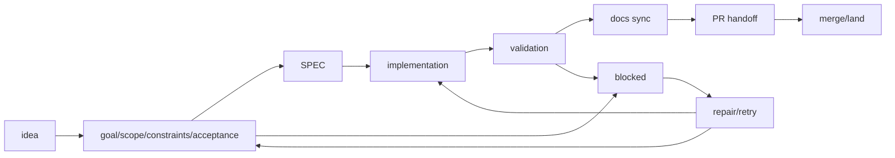

<!-- Generated by `namba sync`. Edit `.namba/config/sections/docs.yaml` or the README renderer instead of editing this file directly. -->

# 워크플로 가이드

[English](../README.md) | [한국어](../README.ko.md) | [日本語](../README.ja.md) | [中文](../README.zh.md)

[시작 가이드](./getting-started.ko.md) | [워크플로 가이드](./workflow-guide.ko.md) | [검증 가이드](./verification-guide.ko.md) | [Codex Upstream Reference](./codex-upstream-reference.md)

[Latest Release](https://github.com/Nam-Cheol/namba-ai/releases/latest) | [CI](https://github.com/Nam-Cheol/namba-ai/actions/workflows/ci.yml) | [Security](../SECURITY.md)

NambaAI 워크플로는 먼저 저장소를 읽고, 작업을 SPEC로 정리하고, 구현/검증한 뒤, sync/PR/land로 인계하는 흐름입니다. 이 가이드는 비슷해 보이는 명령을 빠르게 구분하고 어느 단계에서 무엇을 실행할지 고르는 지도입니다.

## 목차

- [명령 선택표](#명령-선택표)
- [워크플로 한눈에 보기](#워크플로-한눈에-보기)
- [`update`, `regen`, `sync`, `pr`, `land`는 서로 다른 명령입니다](#update-regen-sync-pr-land는-서로-다른-명령입니다)
- [계획 명령](#계획-명령)
- [`namba run` 모드](#namba-run-모드)
- [SPEC queue conveyor](#spec-queue-conveyor)
- [리뷰 준비도](#리뷰-준비도)
- [PR 및 머지 흐름](#pr-및-머지-흐름)
- [참고 문서](#참고-문서)

## 명령 선택표

| 필요 | 명령 | 결과 |
| --- | --- | --- |
| 저장소 상태를 다시 읽기 | `namba project` | `.namba/project/*`와 codemap을 갱신합니다. |
| 기능 또는 제품 변경을 계획 | `namba plan "description"` | 다음 `SPEC-XXX`와 review artifact를 만듭니다. |
| skill/agent/workflow 재사용 작업을 계획 | `namba harness "description"` | harness-oriented SPEC를 만듭니다. |
| 버그를 바로 고치기 | `namba fix "issue"` | 현재 workspace에서 direct repair를 시작합니다. |
| 이미 만든 SPEC 실행 | `namba run SPEC-XXX` | 구현, 테스트, 검증을 진행합니다. |
| 여러 SPEC을 순서대로 처리 | `namba queue start SPEC-001..SPEC-003` | durable queue state로 한 번에 하나씩 진행합니다. |
| 산출물만 새로 고침 | `namba sync` | README, project docs, codemap, checklist, release notes를 갱신합니다. |
| 리뷰 인계 | `namba pr "title"` | 검증, commit, push, PR을 처리합니다. Codex review는 `--review`로 명시합니다. |
| 승인된 PR merge | `namba land` | clean PR만 merge하고 local `main`을 갱신합니다. |

## 워크플로 한눈에 보기

| 단계 | 실행 | 확인할 것 |
| --- | --- | --- |
| 1. 상황 파악 | `namba project` | project docs와 codemap이 최신인지 확인합니다. |
| 2. 계획 | `namba plan`, `namba harness`, `namba fix --command plan` | SPEC와 reviews/readiness가 생겼는지 확인합니다. |
| 3. 실행 | `namba run SPEC-XXX` | acceptance, tests, validation 결과를 확인합니다. |
| 4. 정리 | `namba sync` | generated docs와 checklist가 drift 없이 갱신됐는지 봅니다. |
| 5. 인계 | `namba pr "title"` | PR 언어와 checks를 확인합니다. Codex review는 `--review`를 쓴 경우에만 확인합니다. |
| 6. 머지 | `namba land` | clean+approved PR만 `main`으로 merge합니다. |

### SPEC 생명주기

SPEC은 아이디어를 수용 기준까지 정리한 뒤 구현, 검증, 문서 동기화, PR 인계, merge/land로 이동합니다. 애매하거나 검증이 실패하면 blocked 상태에서 repair/retry로 돌아갑니다.

## `update`, `regen`, `sync`, `pr`, `land`는 서로 다른 명령입니다

- `namba update`: 설치된 CLI를 GitHub Release 자산 기준으로 self-update 합니다.
- `codex update`: upstream Codex CLI를 업데이트합니다. `namba update`와 별개의 명령입니다.
- `namba update`는 Codex 0.131 baseline advice를 출력할 수 있지만 Codex 설치나 업데이트는 관리하지 않습니다.
- Codex diagnostics evidence는 `.namba/logs/project/codex-diagnostics-evidence.json`, `.namba/logs/runs/<log-id>-evidence.json`, `.namba/logs/runs/<spec-id-lower>-queue-evidence.json`에서 확인합니다. `codex doctor` 로그는 evidence를 만든 artifact 옆에 redacted text로 저장됩니다.
- `namba regen`: AGENTS, skills, custom agents, repo Codex config 같은 template-generated asset을 다시 생성합니다.
- `namba sync`: README, 프로젝트 문서, codemap, advisory review readiness, PR checklist, release notes를 갱신합니다.
- `namba queue`: 이미 존재하는 SPEC 패키지를 새로 만들지 않고 순서대로 처리하며, durable state와 Git/GitHub gate를 기준으로 안전하게 resume/block 합니다.
- `namba pr`: 기본적으로 sync와 validation을 돌리고, 현재 브랜치를 commit/push 한 뒤 PR을 만들거나 재사용합니다. Codex review가 필요할 때만 `namba pr --review`를 사용합니다.
- `namba land`: 필요하면 체크를 기다리고, PR이 깨끗할 때만 머지한 뒤 로컬 `main`을 안전하게 갱신합니다.

## 계획 명령

- `$namba-help`: NambaAI 사용법, 다음에 어떤 명령이나 skill을 선택할지, 어디 문서를 봐야 하는지 read-only로 안내합니다.
- `$namba-coach`: 현재 목표를 짧게 정리하고, 필요한 질문만 한 뒤 올바른 Namba workflow handoff를 read-only로 추천합니다.
- `$namba-create`: repo-local skill이나 project-scoped custom agent가 직접 필요할 때 preview-first 생성 경로를 제공합니다. SPEC 패키지가 목적이면 `namba plan` 또는 `namba harness`를 고르세요.
- `namba project`: 현재 저장소 문서와 codemap을 새로 고치며 SPEC 패키지를 만들지 않습니다.
- `namba codex access`: Namba runner의 `codex exec` access 기본값을 inspect-only로 확인하고, 명시적 flag를 줄 때만 `.namba/config/sections/system.yaml`의 approval_policy / sandbox_mode를 변경합니다. Interactive Codex approval mode, permissions, service tier, workspace roots, sandbox 선택은 user/session-owned입니다.
- `namba plan "description"`: 다음 기능 SPEC 패키지와 review artifact를 만들고, `--no-review`가 없으면 `$namba-plan-review`로 바로 이어갑니다.
- clarification gate: `게시판 만들어줘`처럼 모호한 plan 요청은 project 문서 확인이나 CLI 실행 전에 질문부터 반복합니다. Codex Plan mode 선택 UI를 쓸 수 있으면 그 출력을 refined prompt로 삼아 `namba plan`에 넘깁니다.
- `namba harness "description"`: agent, skill, workflow, orchestration 재사용을 위한 harness-oriented SPEC 패키지와 review artifact를 만듭니다.
- `namba fix --command plan "issue description"`: 버그 수정 SPEC 패키지와 review artifact를 만듭니다.
- planning 기본값: 현재 workspace에서 전용 `spec/...` 브랜치를 만들거나 전환해 scaffold합니다. `--current-workspace`는 새 SPEC 브랜치 없이 현재 브랜치에 바로 scaffold하려는 경우에만 쓰고, worktree는 임시 `namba run SPEC-XXX --parallel` 실행에만 사용합니다.
- `namba fix "issue description"`: 현재 workspace에서 direct repair를 시작합니다.
- `namba fix --command run "issue description"`: 같은 direct-repair 경로를 명시적으로 선택합니다.
- `namba <command> --help`, `namba <command> -h`, `namba help <command>`: 모든 top-level command에서 read-only help 경로로 끝나며 repo state를 바꾸지 않습니다.

## `namba run` 모드

- `namba run SPEC-XXX`: 하나의 workspace에서 실행하는 표준 standalone Codex 흐름입니다.
- `namba run SPEC-XXX --solo`: 하나의 workspace에서 단일 runner를 사용합니다.
- `namba run SPEC-XXX --team`: 같은 workspace 안에서 멀티에이전트 실행을 조율합니다.
- `namba run SPEC-XXX --parallel`: Codex subagent orchestration이 아니라 Namba가 관리하는 git worktree fan-out/fan-in 입니다.
- Codex subagent threads는 `.codex/config.toml [agents].max_threads = 5`, Namba worktree workers는 `.namba/config/sections/workflow.yaml max_parallel_workers: 3`로 따로 관리합니다.

## SPEC queue conveyor

- `namba queue start SPEC-001..SPEC-003`: 이미 존재하는 SPEC 패키지를 새로 생성하지 않고 지정된 순서대로 처리합니다.
- `namba queue start SPEC-001 SPEC-004 --review`: 명시한 SPEC 목록만 대상으로 삼고, PR handoff 때 Codex review를 요청합니다. `--skip-codex-review`는 deprecated no-op 호환 플래그입니다.
- `namba queue status`: active SPEC, durable state, blocker/wait reason, report path, 다음 안전한 명령을 보여줍니다.
- `namba queue resume`, `pause`, `stop`: `.namba/logs/queue/`에 저장된 durable state를 기준으로 이어가거나 멈춥니다.
- Queue는 한 번에 하나의 active SPEC만 실행합니다. validation 실패, failed checks, non-mergeable PR, 애매한 Git/GitHub 상태에서는 skip하지 않고 blocked로 멈춥니다.
- `--auto-land`를 켜지 않으면 green+mergeable PR에서도 `waiting_for_land` 상태로 멈춰 operator가 확인할 수 있게 합니다.

## 역할 라우팅

- 기본 `namba run`은 prompt에 강한 specialist 신호가 없으면 standalone runner에 머뭅니다.
- `--solo`는 위험을 실질적으로 줄일 specialist 한 명이 있을 때만 분기하고, `--team`은 acceptance가 여러 도메인에 걸칠 때 여러 specialist와 마지막 reviewer를 같은 workspace 안에서 조율합니다.
- art direction, palette/tone logic, composition, motion intent, Figma critique, generic section redesign은 `namba-designer`로, component boundary, state ownership, UI delivery planning은 `namba-frontend-architect`로, 승인된 UI 구현은 `namba-frontend-implementer`로, 모바일 전용 UI 전달은 `namba-mobile-engineer`로 보냅니다. API, schema, pipeline 작업은 `namba-backend-implementer`, `namba-data-engineer`로, auth, secrets, compliance는 `namba-security-engineer`로, deployment와 runtime은 `namba-devops-engineer`로 보냅니다.
- Examples: `Redesign the hero so it stops looking generic`는 `namba-designer`, `Plan the component boundaries for this dashboard`는 `namba-frontend-architect`, `Implement the approved dashboard filters`는 `namba-frontend-implementer`에 보냅니다.
- standalone runner는 integrator이자 validation owner로 두고, uncontrolled swarm 대신 마지막 acceptance는 `namba-reviewer`에게 맡깁니다.

## 리뷰 준비도

- `namba plan`, `namba harness`, `namba fix --command plan`은 `.namba/specs/<SPEC>/reviews/product.md`, `engineering.md`, `design.md`, `readiness.md`를 seed 합니다.
- 구현이나 GitHub handoff 전에 `$namba-plan-pm-review`, `$namba-plan-eng-review`, `$namba-plan-design-review`로 review 산출물을 최신 상태로 유지하고, 생성부터 review loop까지 한 번에 처리하고 싶다면 `$namba-plan-review`를 사용하세요.
- `$namba-plan-review`도 같은 planning branch contract를 따릅니다. 기본적으로 현재 workspace에서 전용 `spec/...` 브랜치를 만들거나 전환하고, `--current-workspace`만 예외이며, planning 단계에서는 worktree를 만들지 않습니다.
- `namba regen` 또는 `namba sync`가 생성된 instruction surface를 바꾸면, 긴 repair loop를 이어 가기 전에 fresh Codex session을 시작해 갱신된 지침을 다시 불러오세요.
- 리뷰 통과가 없어도 기본적으로 advisory 상태를 유지합니다. `namba run`, `namba sync`, `namba pr`는 readiness 요약을 보여주지만 조용히 hard gate로 바꾸지는 않습니다.

## PR 및 머지 흐름

- `namba sync`는 로컬 산출물 갱신에만 머뭅니다.
- `namba pr`는 validation, commit, push, PR handoff를 담당합니다.
- `namba land`는 clean PR을 merge하고 local `main`을 갱신합니다.

## 주요 생성 산출물

- `.namba/`: config, SPEC packages, project docs, logs
- `.namba/specs/<SPEC>/reviews/`: 각 SPEC의 advisory product, engineering, design, readiness artifact
- `.agents/skills/`: Codex가 직접 사용하는 repo-local skills
- `.codex/config.toml`: repo-local hook/agent/MCP defaults; interactive approval mode, permissions, service tier, workspace roots, and sandbox choices stay user/session-owned
- `.codex/agents/*.toml`: project-scoped custom agents
- `.namba/project/*`: change summary, release notes, checklist, codemap

## 협업 기본값

- 작업은 전용 브랜치에서 진행합니다.
- `namba pr`은 `main`을 대상으로 하고, 설정된 PR 언어와 review marker를 그대로 유지합니다.
- `namba land`는 깨끗한 PR만 머지하고, 관련 없는 로컬 작업을 덮어쓰지 않은 채 `main`을 갱신합니다.
- GitHub review 요청은 `@codex review`를 사용합니다.

## 🚢 릴리스 흐름

- `$namba-release`는 clean `main`, 검증, commit 기반 릴리스 노트, `.namba/releases/<version>.md` handoff를 확인한 뒤 릴리스를 진행하는 Codex-facing workflow입니다.
- `namba release`는 `main`에서 clean working tree를 요구합니다.
- `--push`는 새 태그와 `main`을 함께 push한 뒤 GitHub Release workflow를 트리거합니다.
- GitHub Release body는 생성된 릴리스 노트를 사용하고, 기존 asset matrix와 필수 `checksums.txt` publication은 유지됩니다. 모든 release archive는 installer가 압축 해제 전에 검증할 수 있도록 정확한 asset 이름으로 `checksums.txt`에 포함되어야 합니다.

## 참고 문서

- [시작 가이드](./getting-started.ko.md): 설치와 첫 실행 흐름
- [검증 가이드](./verification-guide.ko.md): local quality, eval/report artifacts, CI, evidence, failure interpretation
- [Codex Upstream Reference](./codex-upstream-reference.md): 이 저장소가 따르는 Codex 기준
- [MoAI-ADK -> Codex Migration Analysis](./moai-adk-codex-migration-analysis.md): provider migration 배경과 설계 맥락

고급 참고 자료

- 긴 command semantics, queue state, review readiness, PR/merge flow는 workflow guide에 둡니다.
- [워크플로 가이드](./workflow-guide.ko.md)
- [Release](https://github.com/Nam-Cheol/namba-ai/releases/latest)
- [CI](https://github.com/Nam-Cheol/namba-ai/actions/workflows/ci.yml)
- [Security](../SECURITY.md)

