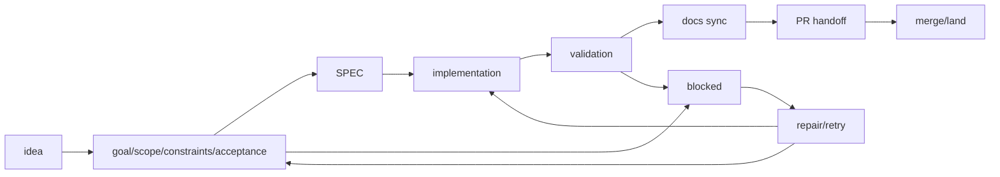

<!-- Generated by `namba sync`. Edit `.namba/config/sections/docs.yaml` or the README renderer instead of editing this file directly. -->

# 工作流指南

[English](../README.md) | [한국어](../README.ko.md) | [日本語](../README.ja.md) | [中文](../README.zh.md)

[快速开始](./getting-started.zh.md) | [工作流指南](./workflow-guide.zh.md) | [验证指南](./verification-guide.zh.md) | [Codex Upstream Reference](./codex-upstream-reference.md)

[Latest Release](https://github.com/Nam-Cheol/namba-ai/releases/latest) | [CI](https://github.com/Nam-Cheol/namba-ai/actions/workflows/ci.yml) | [Security](../SECURITY.md)

NambaAI 工作流会先读取仓库，把工作整理成 SPEC，完成实现和验证，然后通过 sync / PR / land 交接。本文档是区分相似命令、选择每个阶段下一步动作的地图。

## 目录

- [命令选择表](#命令选择表)
- [工作流速览](#工作流速览)
- [`update`、`regen`、`sync`、`pr`、`land` 是不同的命令](#updateregensyncprland-是不同的命令)
- [规划命令](#规划命令)
- [`namba run` 模式](#namba-run-模式)
- [SPEC queue conveyor](#spec-queue-conveyor)
- [评审准备度](#评审准备度)
- [PR 与合并流程](#pr-与合并流程)
- [参考文档](#参考文档)

## 命令选择表

| 需求 | 命令 | 结果 |
| --- | --- | --- |
| 重新读取仓库状态 | `namba project` | 刷新 `.namba/project/*` 和 codemap。 |
| 规划功能或产品变更 | `namba plan "description"` | 创建下一个 `SPEC-XXX` 和 review artifact。 |
| 规划 skill / agent / workflow 复用工作 | `namba harness "description"` | 创建 harness-oriented SPEC。 |
| 直接修 bug | `namba fix "issue"` | 在当前 workspace 启动 direct repair。 |
| 执行已有 SPEC | `namba run SPEC-XXX` | 进行实现、测试和验证。 |
| 按顺序处理多个 SPEC | `namba queue start SPEC-001..SPEC-003` | 通过 durable queue state 一次处理一个。 |
| 只刷新产物 | `namba sync` | 刷新 README、project docs、codemap、checklist 和 release notes。 |
| 交给评审 | `namba pr "title"` | 处理 validation、commit、push 和 PR。Codex review 通过 `--review` 显式请求。 |
| 合并已批准 PR | `namba land` | 只合并 clean PR 并更新本地 `main`。 |

## 工作流速览

| 阶段 | 运行 | 检查点 |
| --- | --- | --- |
| 1. 了解现状 | `namba project` | 确认 project docs 和 codemap 是否最新。 |
| 2. 规划 | `namba plan`、`namba harness`、`namba fix --command plan` | 确认 SPEC 和 reviews/readiness 已生成。 |
| 3. 执行 | `namba run SPEC-XXX` | 检查 acceptance、tests 和 validation 结果。 |
| 4. 整理 | `namba sync` | 确认 generated docs 和 checklist 无 drift。 |
| 5. 交接 | `namba pr "title"` | 检查 PR language 和 checks。只有使用 `--review` 时才检查 Codex review。 |
| 6. 合并 | `namba land` | 只把 clean+approved PR merge 到 `main`。 |

### SPEC 生命周期

SPEC 会把 idea 整理到 acceptance，再进入 implementation、validation、docs sync、PR handoff 和 merge/land。状态不明确或 validation 失败时会进入 blocked，并回到 repair/retry。

## `update`、`regen`、`sync`、`pr`、`land` 是不同的命令

- `namba update`: 从 GitHub Release 资产对已安装的 CLI 做 self-update。
- `codex update`: 更新 upstream Codex CLI。这和 `namba update` 是不同命令。
- `namba regen`: 重新生成 AGENTS、skills、custom agents、repo Codex config 等 template-generated asset。
- `namba sync`: 刷新 README、project docs、codemap、advisory review readiness、PR checklist 和 release notes。
- `namba queue`: 按顺序处理已有 SPEC package，不会创建新的 SPEC，并用 durable state 与 Git/GitHub gate 安全 resume / block。
- `namba pr`: 默认先跑 sync 和 validation，把当前分支 commit / push 后创建或复用 PR。只有需要 Codex review 时才使用 `namba pr --review`。
- `namba land`: 需要时等待 checks，只在 PR clean 时 merge，然后安全更新本地 `main`。

## 规划命令

- `$namba-help`: 以 read-only 方式说明如何使用 NambaAI、下一步该选哪个命令或 skill、以及应该看哪些文档。
- `$namba-coach`: 简要重述当前目标，只提出必要问题，然后以 read-only 方式推荐正确的 Namba workflow handoff。
- `$namba-create`: 当你直接需要 repo-local skill 或 project-scoped custom agent 时，使用这个 preview-first 创建路径。如果目标是 SPEC 包，请选择 `namba plan` 或 `namba harness`。
- `namba project`: 刷新当前仓库文档和 codemap，不会创建 SPEC 包。
- `namba codex access`: 以 inspect-only 方式查看 Namba runner 的 `codex exec` access 默认值，只有传入明确 flag 时才会修改 `.namba/config/sections/system.yaml` 中的 approval_policy / sandbox_mode。Interactive Codex approval mode、permissions、service tier、workspace roots、sandbox choices 由 user/session 拥有。
- `namba plan "description"`: 创建下一个功能 SPEC 包和 review artifact；如果没有 `--no-review`，会继续交给 `$namba-plan-review`。
- clarification gate：像“做个论坛”这样的模糊 plan request，会先继续提问，再检查项目文档或运行 CLI。若可使用 Codex Plan mode 选择 UI，则把其输出作为 refined prompt 传给 `namba plan`。
- `namba harness "description"`: 创建面向 agent / skill / workflow / orchestration 复用的 harness-oriented SPEC 包和 review artifact。
- `namba fix --command plan "issue description"`: 创建缺陷修复 SPEC 包和 review artifact。
- planning 默认行为：在当前 workspace 中创建或切换到专用 `spec/...` branch 再 scaffold。`--current-workspace` 只用于明确要求直接在当前 branch 上 scaffold、不新建 SPEC branch；worktree 只用于临时的 `namba run SPEC-XXX --parallel` 执行。
- `namba fix "issue description"`: 在当前 workspace 启动 direct repair。
- `namba fix --command run "issue description"`: 显式选择同一个 direct-repair 路径。
- `namba <command> --help`、`namba <command> -h`、`namba help <command>`: 所有 top-level command 都会走 read-only help 路径，不会改变 repo state。

## `namba run` 模式

- `namba run SPEC-XXX`: 在单一 workspace 中运行的标准 standalone Codex flow。
- `namba run SPEC-XXX --solo`: 在单一 workspace 中使用单 runner。
- `namba run SPEC-XXX --team`: 在同一 workspace 内协调 multi-agent execution。
- `namba run SPEC-XXX --parallel`: 这不是 Codex subagent orchestration，而是由 Namba 管理的 git worktree fan-out/fan-in。
- Codex subagent threads 由 `.codex/config.toml [agents].max_threads = 5` 管理，Namba worktree workers 由 `.namba/config/sections/workflow.yaml max_parallel_workers: 3` 分开管理。

## SPEC queue conveyor

- `namba queue start SPEC-001..SPEC-003`: 按指定顺序处理已有 SPEC package，不会创建新的 SPEC。
- `namba queue start SPEC-001 SPEC-004 --review`: 只处理指定 SPEC 列表，并在 PR handoff 时请求 Codex review。`--skip-codex-review` 是 deprecated no-op 兼容标志。
- `namba queue status`: 显示 active SPEC、durable state、blocker / wait reason、report path 和下一条安全命令。
- `namba queue resume`、`pause`、`stop`: 基于 `.namba/logs/queue/` 中保存的 durable state 继续或停止。
- Queue 一次只允许一个 active SPEC。validation 失败、failed checks、non-mergeable PR 或 Git/GitHub 状态不明确时，不会 skip，而是 blocked 停止。
- 未启用 `--auto-land` 时，即使 PR green+mergeable，也会停在 `waiting_for_land` 供 operator 确认。

## 角色路由

- 默认的 `namba run` 会停留在 standalone runner，除非 prompt 明确显示出强烈的 specialist signal。
- `--solo` 只会在一个 specialist 能显著降低风险时分流，`--team` 则会在 acceptance 跨多个领域时，在同一 workspace 内协调多个 specialist 和最后的 reviewer。
- art direction、palette/tone logic、composition、motion intent、Figma critique、generic section redesign 交给 `namba-designer`；component boundary、state ownership、UI delivery planning 交给 `namba-frontend-architect`；已批准的 UI 实现交给 `namba-frontend-implementer`；移动端专属 UI 交给 `namba-mobile-engineer`。API、schema、pipeline 交给 `namba-backend-implementer`、`namba-data-engineer`；auth、secrets、compliance 交给 `namba-security-engineer`；deployment 和 runtime 交给 `namba-devops-engineer`。
- Examples: `Redesign the hero so it stops looking generic` 交给 `namba-designer`，`Plan the component boundaries for this dashboard` 交给 `namba-frontend-architect`，`Implement the approved dashboard filters` 交给 `namba-frontend-implementer`。
- 让 standalone runner 继续担任 integrator 和 validation owner，最终 acceptance 交给 `namba-reviewer`，不要扩散成失控的 swarm。

## 评审准备度

- `namba plan`、`namba harness` 和 `namba fix --command plan` 会 seed `.namba/specs/<SPEC>/reviews/product.md`、`engineering.md`、`design.md`、`readiness.md`。
- 在实现或 GitHub handoff 之前，使用 `$namba-plan-pm-review`、`$namba-plan-eng-review`、`$namba-plan-design-review` 保持 review artifact 最新；如果想把创建到 review loop 打包处理，就使用 `$namba-plan-review`。
- `$namba-plan-review` 也遵循同一个 planning branch contract：默认在当前 workspace 中创建或切换到专用 `spec/...` branch，只有 `--current-workspace` 是例外，而且 planning 阶段不会创建 worktree。
- 如果 `namba regen` 或 `namba sync` 改变了生成的 instruction surface，请在继续长 repair loop 之前启动一个 fresh Codex session，以重新加载更新后的 guidance。
- 即使 review pass 缺失，默认也只是 advisory。`namba run`、`namba sync`、`namba pr` 会展示 readiness summary，但不会悄悄变成 hard gate。

## PR 与合并流程

- `namba sync` 只负责刷新本地产物。
- `namba pr` 负责 validation、commit、push 和 PR handoff。
- `namba land` 负责合并 clean PR 并更新本地 `main`。

## 主要生成产物

- `.namba/`: config、SPEC packages、project docs、logs
- `.namba/specs/<SPEC>/reviews/`: 每个 SPEC 的 advisory product / engineering / design / readiness artifact
- `.agents/skills/`: Codex 直接使用的 repo-local skills
- `.codex/config.toml`: repo-local hook / agent / MCP defaults；interactive approval mode、permissions、service tier、workspace roots、sandbox choices 仍由 user/session 拥有
- `.codex/agents/*.toml`: project-scoped custom agents
- `.namba/project/*`: change summary、release notes、checklist、codemap

## 协作默认值

- 工作应在专用分支上进行。
- `namba pr` 以 `main` 为目标，并保持配置中的 PR 语言和 review marker 一致。
- `namba land` 只合并 clean PR，并在不覆盖无关本地改动的前提下更新 `main`。
- GitHub review request 使用 `@codex review`。

## 🚢 发布流程

- `$namba-release` 是 Codex-facing workflow，会先确认 clean `main`、validation、基于 commit 的 release notes，以及 `.namba/releases/<version>.md` handoff。
- `namba release` 要求 `main` 上是 clean working tree。
- `--push` 会同时 push 新 tag 和 `main`，然后触发 GitHub Release workflow。
- GitHub Release body 使用生成的 release notes，并保留现有 asset matrix 和必需的 `checksums.txt` publication。所有 release archive 都必须以准确 asset 名列在 `checksums.txt` 中，因为 installer 会在解压前验证该条目。

## 参考文档

- [快速开始](./getting-started.zh.md): 安装和首次运行流程
- [验证指南](./verification-guide.zh.md): local quality, eval/report artifacts, CI, evidence, failure interpretation
- [Codex Upstream Reference](./codex-upstream-reference.md): 本仓库遵循的 Codex 基线
- [MoAI-ADK -> Codex Migration Analysis](./moai-adk-codex-migration-analysis.md): provider migration 背景和设计上下文

高级参考

- 较长的 command semantics、queue state、review readiness、PR/merge flow 放在 workflow guide 中。
- [工作流指南](./workflow-guide.zh.md)
- [Release](https://github.com/Nam-Cheol/namba-ai/releases/latest)
- [CI](https://github.com/Nam-Cheol/namba-ai/actions/workflows/ci.yml)
- [Security](../SECURITY.md)

